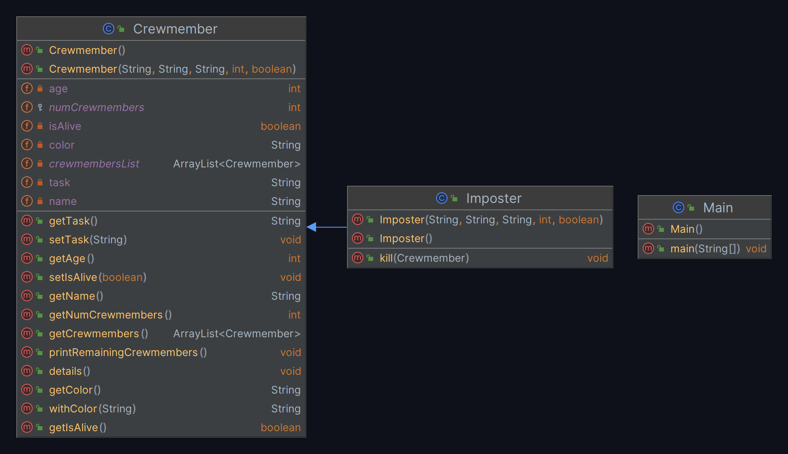

# Program Write-Up Document

- Oliver Sigwarth
- 10-19-2023
- CIDS 235 - Programming Paradigms
- Assignment 1 - Among Us

**Link to working code: https://replit.com/join/ediygthgdu-theoliverlear**

## Explanation

This document shows the code of the **Among Us** program which simulates the
game Among Us. The program is written in Java and has three distinct classes.
The first class is the Main class, which contains the main method and is
responsible for running the program. The second class is the Crewmember class,
which represents the crewmembers in the game. The third class is the Imposter
class, which represents the imposters in the game. 

## IMPORTANT

For descriptions of the code and the justifications for the design, please
refer to the comments in the code. The comments are meant to explain the
functionality of the code and appear in the places where they are most 
pertinent.

## UML Class Diagram



*Figure 1: UML Class Diagram*

The UML diagram shows the structure of each class and their relationships with
each other. It will show the data fields, methods, and constructors of each
class. The inheritance relationships between the classes are shown by the
arrows.

## The Test Class - Main.java

```java
// Name: Oliver Sigwarth                                                     |
// Assignment 1 - Among Us                                                   |
// Program: Main.java                                                        |
// Description:                                                              |
/*----------------------------------------------------------------------------
 * The goal of this assignment is to practice creating classes and objects.  |
 * You will create a "Crewmember" class and an instance for each Crewmember  |
 * in Among Us and implement methods to interact with those objects.         |
----------------------------------------------------------------------------*/
// Created: 10/12/2023                                                       |
// Last Modified: 10/19/2023                                                 |
//----------------------------------------------------------------------------
public class Main {
            /*-------------------Test-Cases-------------------
            |   |  Name  |  Color |      Task      | Age |   |
            |---|--------|--------|----------------|-----|---|
            |   |  Jimmy |   Cyan |     Electrical |  34 |   |
            |   |  Steve |    Red |         Medbay |  21 |   |
            |   |   Bart |   Lime |     Navigation |  25 |   |
            |   |   Mike | Purple | Communications |  45 |   |
            |   |    Jeb | Yellow |             O2 |  27 |   |
            |   | Dingus |  Green |          Admin |  64 |   |
            |   |  Judas |   Gray |       Impostor | 100 |   |
            ------------------------------------------------*/
    //===========================-Main-Method-================================
    public static void main(String[] args) {
        // The following variables are the crewmembers laid out in the table
        // from the rubric. I'm using the constructor that takes all of the
        // parameters to instantiate the crewmembers as well as utilizing the
        // static data fields to keep track of the number of crewmembers and
        // the amount of crewmembers that are alive.
        //-----------------------Print-Divider--------------------------------
        String separator = "-".repeat(78);
        System.out.println(separator);
        //----------------------Build-Test-Cases------------------------------
        Crewmember jimmy = new Crewmember("Jimmy", "Cyan",
                                     "Electrical", 34, true);
        Crewmember steve = new Crewmember("Steve", "Red",
                                     "Medbay", 21, true);
        Crewmember bart = new Crewmember("Bart", "Lime",
                                    "Navigation", 25, true);
        Crewmember mike = new Crewmember("Mike", "Purple",
                                    "Communications", 45, true);
        Crewmember jeb = new Crewmember("Jeb", "Yellow",
                                   "O2", 27, true);
        Crewmember dingus = new Crewmember("Dingus", "Green",
                                      "Admin", 64, true);
        Imposter judas = new Imposter("Judas", "Gray",
                                         "Impostor", 100, true);
        //--------------------Demonstrate-Getters-----------------------------
        System.out.println("Jimmy's name is: " + jimmy.getName());
        System.out.println("Steve's color is: " + steve.getColor());
        System.out.println("Bart's task is: " + bart.getTask());
        System.out.println("Mike's age is: " + mike.getAge());
        System.out.println("Jeb is alive: " + jeb.getIsAlive());
        System.out.println("Dingus' task is: " + dingus.getTask());
        System.out.println("Judas' task is: " + judas.getTask());
        System.out.printf("There are %d crewmembers.\n",
                           Crewmember.getNumCrewmembers());
        //--------------------Demonstrate-Setters-----------------------------
        System.out.println(separator);
        String newTask = "Storage";
        System.out.println("Changing Jimmy's task from " + jimmy.getTask()
                         + " to " + newTask + ".");
        jimmy.setTask("Storage");
        jimmy.details();
        //===================-Demonstrate-Methods-============================
        //------------------------Kill-Method---------------------------------
        System.out.println(separator);
        judas.kill(jimmy);
        System.out.println(jimmy.getName() + " is alive: "
                         + jimmy.getIsAlive());
        System.out.printf("There are %d crewmembers.\n",
                           Crewmember.getNumCrewmembers());
        //-----------------------Details-Method-------------------------------
        System.out.println(separator);
        for (Crewmember crewmember : Crewmember.getCrewmembers()) {
            crewmember.details();
        }
        //----------------Print-Remaining-Crewmembers-------------------------
        System.out.println(separator);
        Crewmember.printRemainingCrewmembers();
    }
}
```

*Listing 1: Test Program Class*

The test class is meant to show the functionality of the program. It is not a
representation of the game itself, but rather it has the functionality for the
game using object-oriented design. You will see many print statements showing
the methods as well as the modular nature of certain data fields.

## Other Classes

### Crewmember.java

```java
// Name: Oliver Sigwarth                                                     |
// Assignment 1 - Among Us                                                   |
// Program: Crewmember.java                                                  |
// Description:                                                              |
/*----------------------------------------------------------------------------
 * The goal of this assignment is to practice creating classes and objects.  |
 * You will create a "Crewmember" class and an instance for each Crewmember  |
 * in Among Us and implement methods to interact with those objects.         |
----------------------------------------------------------------------------*/
// Created: 10/12/2023                                                       |
// Last Modified: 10/19/2023                                                 |
//----------------------------------------------------------------------------
import java.util.ArrayList;
public class Crewmember {
    private String name;
    private String color;
    private String task;
    private int age;
    private boolean isAlive;
    // The numCrewmembers variable is set to protected so the Imposter class
    // can mutate the number when a crewmember is killed.
    protected static int numCrewmembers = 0;
    private static ArrayList<Crewmember> crewmembersList = new ArrayList<>();
    //----------------------------Constructors--------------------------------
    public Crewmember() {
        // A default constructor is added for those who may want to play the
        // game without having custom settings. They can be provided a default
        // crewmember with the following settings.
        this("John", "Red", "Carpenter", 10, true);
    }
    public Crewmember(String name, String color, String task, int age,
                      boolean isAlive) {
        // This constructor is used to create a crewmember with custom
        // settings. It is also used to keep track of the number of
        // crewmembers by incrementing numCrewmembers when a new crewmember is
        // instantiated. This constructor adds the crewmember to the
        // crewmembersList to keep track of them so that the
        // printRemainingCrewmembers() method can iterate through the list and
        // print the remaining crewmembers.
        this.name = name;
        this.color = color;
        this.task = task;
        this.age = age;
        this.isAlive = isAlive;
        numCrewmembers++;
        crewmembersList.add(this);
    }
    //------------------------------Getters-----------------------------------
    // Getters are allowed for all fields because they are all private and
    // cannot be accessed outside of the class. Per the rubric, all fields
    // need to be accessed to demonstrate their functionality and so they are
    // safely accessible through getters.
    public String getName() {
        return this.name;
    }
    public String getColor() {
        return this.color;
    }
    public String getTask() {
        return this.task;
    }
    public int getAge() {
        return this.age;
    }
    public boolean getIsAlive() {
        return this.isAlive;
    }
    public static int getNumCrewmembers() {
        return numCrewmembers;
    }
    public static ArrayList<Crewmember> getCrewmembers() {
        return crewmembersList;
}
    //------------------------------Setters-----------------------------------
    // Setters are only allowed for the fields that may change during the
    // program. The task may change during the program like in the game. The
    // isAlive variable may change during the program if the crewmember is
    // killed by the imposter. The absence of these methods are meant to
    // demonstrate that the fields should not be changed and is only allowed
    // through the constructor.
    public void setTask(String task) {
        this.task = task;
    }
    public void setIsAlive(boolean isAlive) {
        this.isAlive = isAlive;
    }
    //------------------------------Methods-----------------------------------
    public void details() {
        // Prints the details of each crewmember. The details include the
        // name, color, task, and age. The name and color are printed in their
        // respective colors.
        System.out.printf("My name is %s, my color is %s, my task is %s," +
                          " and I am %d years old.\n",
                          this.withColor(this.name),
                          this.withColor(this.color), this.task, this.age);
    }
    //-----------------------------Color-Text---------------------------------
    public String withColor(String phrase) {
        // This method takes a phrase and colors it based on the color of the
        // crewmember. The colors are based on the ANSI color codes and they
        // are assigned based on a switch of the color of the crewmember.
        String colorLowered = this.color.toLowerCase();
        final String resetCode = "\u001B[0m";
        String colorCode = switch (colorLowered) {
            case "cyan" -> "\u001B[36m";
            case "red" -> "\u001B[31m";
            case "lime" -> "\u001B[32m";
            case "purple" -> "\u001B[35m";
            case "yellow" -> "\u001B[33m";
            case "green" -> "\u001B[32m";
            case "gray" -> "\u001B[37m";
            default -> throw new IllegalStateException("Unexpected value: " +
                                                        colorLowered);
        };
        String coloredPhrase = colorCode + phrase + resetCode;
        return coloredPhrase;
    }
    //--------------------Print-Remaining-Crewmembers-------------------------
    public static void printRemainingCrewmembers() {
        // This method prints the remaining crewmembers. It iterates through
        // the crewmembersList and it will only print if the crewmember
        // isAlive.
        System.out.println("The remaining crewmembers are:");
        for (Crewmember crewmember : crewmembersList) {
            if (crewmember.getIsAlive()) {
                System.out.println(crewmember.withColor(
                                   crewmember.getName()));
            }
        }
    }
}
```

*Listing 2: Crewmember*

The Crewmember class is responsible for representing the crewmember in the
game. It has data fields that represent the crewmember's name, color, task,
age, and whether or not they are alive. It also has methods that allow for the
program to safely access its appropriate data fields. The class has methods
which show the details of a Crewmember object, as well as show the remaining
crewmembers.

### Imposter.java

```java
// Name: Oliver Sigwarth                                                     |
// Assignment 1 - Among Us                                                   |
// Program: Imposter.java                                                    |
// Description:                                                              |
/*----------------------------------------------------------------------------
 * The goal of this assignment is to practice creating classes and objects.  |
 * You will create a "Crewmember" class and an instance for each Crewmember  |
 * in Among Us and implement methods to interact with those objects.         |
----------------------------------------------------------------------------*/
// Created: 10/12/2023                                                       |
// Last Modified: 10/19/2023                                                 |
//----------------------------------------------------------------------------
public class Imposter extends Crewmember {
    //----------------------------Constructors--------------------------------
    public Imposter() {
        // A default constructor is added for those who may want to play the
        // game without having custom settings. They can be provided a default
        // imposter with the settings defined in the parent class. Since it
        // inherits from the Crewmember class, it uses the super keyword to
        // call the parent constructor.
        super();
    }
    public Imposter(String name, String color, String task, int age,
                    boolean isAlive) {
        // This constructor is used to create an imposter with custom
        // settings. Since it inherits from the Crewmember class, it uses the
        // super keyword to call the parent constructor.
        super(name, color, task, age, isAlive);
    }
    //------------------------------Methods-----------------------------------
    public void kill(Crewmember crewmember) {
        // If the imposter is alive and the crewmember they want to kill is
        // alive, then the imposter can kill the crewmember. The crewmember
        // is killed by setting their isAlive variable to false and the
        // numCrewmembers variable is decremented.
        if (crewmember.getIsAlive() && this.getIsAlive()) {
            System.out.println(crewmember.getName() + " has been killed!");
            crewmember.setIsAlive(false);
            numCrewmembers--;
        }
    }
}
```

*Listing 3: Imposter*

The Imposter class is responsible for representing the imposters in the game.
It contains all of the same data fields as the Crewmember class since the 
class inherits from the Crewmember class. In addition to the same data fields
and methods, the Imposter class has the unique ability to kill crewmembers, or
set their isAlive status to false.

## Conclusion

This program is a demonstration of the object-oriented design of a game like
Among Us. It shows the relationships between the classes and how they can
interact with each other. It also shows the functionality and modularity of
object-oriented design. This document is meant to share the core information
about the program and its design.

## Citations

*None*